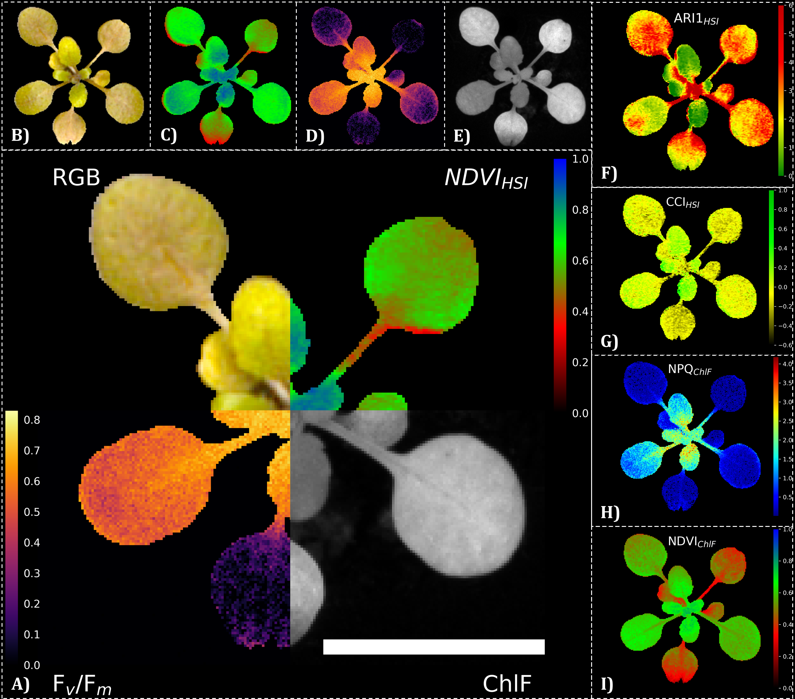

# HyperKorReader
Reading multidimensional data into one python class object. Package was disgned to work with HAIP BlackBox V2 hyperspectral and RGB camera as well as PhenoVation PlantExplorer XS

This is the official code implementation aof our paper, which is currently under a journal review:

Cite:
Bethge HL, Weisheit I, Dortmund MS, Landes T, Zabic M, Linde M, Debener T, Heinemann D. Automated image registration of RGB, hyperspectral and chlorophyll fluorescence imaging data. Plant Methods. 2024 Nov 17;20(1):175.

